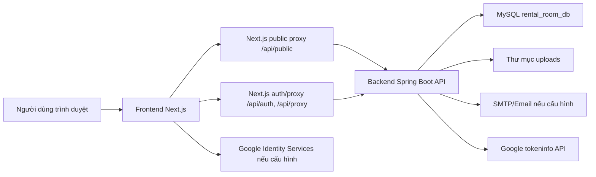

# 01. Tổng quan dự án Homi

## 1. Giới thiệu

Homi là website hỗ trợ tìm kiếm và cho thuê phòng trọ, tập trung vào nhu cầu tìm phòng tại Hà Nội. Hệ thống cung cấp giao diện cho người thuê phòng tra cứu bài đăng, lọc theo tiêu chí, xem chi tiết phòng, lưu phòng quan tâm và gửi yêu cầu liên hệ/xem phòng. Đồng thời, hệ thống có khu vực dành cho người đăng tin để quản lý bài đăng và khách liên hệ, cùng khu vực quản trị dành cho admin để theo dõi toàn bộ dữ liệu.

Dự án được tổ chức theo mô hình tách biệt frontend, backend và database. Frontend đảm nhiệm trải nghiệm người dùng và trung gian BFF/proxy cho các request cần xác thực. Backend đảm nhiệm API nghiệp vụ, xác thực, phân quyền, xử lý dữ liệu và kết nối cơ sở dữ liệu MySQL.

## 2. Mục tiêu hệ thống

Các mục tiêu chính của Homi gồm:

- Hỗ trợ người thuê phòng tìm kiếm thông tin phòng trọ nhanh, có bộ lọc theo khu vực, giá, diện tích, trạng thái và tiện ích.
- Cho phép người dùng đăng ký, đăng nhập, xác minh OTP qua email và đăng nhập bằng Google nếu được cấu hình.
- Cho phép người thuê lưu phòng, gửi yêu cầu liên hệ/xem phòng và xem lịch sử yêu cầu đã gửi.
- Cho phép người đăng tin quản lý bài đăng thuộc sở hữu của mình, xem khách liên hệ và cập nhật hồ sơ cho thuê.
- Cho phép admin quản lý bài đăng, người dùng, yêu cầu liên hệ, báo cáo tin đăng và dashboard thống kê.
- Tổ chức hệ thống theo kiến trúc full-stack rõ ràng, có API backend độc lập và database quan hệ.

## 3. Phạm vi chức năng

Hệ thống hiện có các nhóm chức năng sau:

### Khách chưa đăng nhập

- Xem trang chủ.
- Xem danh sách phòng.
- Tìm kiếm và lọc phòng theo tiêu chí.
- Xem chi tiết phòng.
- Xem thông tin tiện ích, khu vực, giá thuê, diện tích, số điện thoại liên hệ.
- Được yêu cầu đăng nhập khi muốn lưu phòng, gửi yêu cầu hoặc báo cáo tin.

### Người thuê phòng

- Đăng ký tài khoản bằng email, mật khẩu và OTP.
- Đăng nhập bằng email/mật khẩu.
- Đăng nhập Google nếu hệ thống đã cấu hình Google Client ID.
- Cập nhật hồ sơ cá nhân.
- Đổi mật khẩu.
- Lưu hoặc bỏ lưu phòng.
- Xem danh sách phòng đã lưu.
- Gửi yêu cầu liên hệ hoặc yêu cầu xem phòng.
- Xem lịch sử yêu cầu liên hệ.
- Gửi báo cáo tin đăng có vấn đề.
- Nhận thông báo trong hệ thống khi có nghiệp vụ liên quan.

### Chủ trọ/người đăng tin

Trong mã nguồn hiện tại, chủ trọ chưa có role backend riêng tên `HOST`. Khu vực host yêu cầu người dùng đăng nhập, sau đó quyền quản lý bài đăng được kiểm soát bằng quan hệ sở hữu `created_by`. Vì vậy, một người dùng đã đăng nhập có thể vào khu đăng tin; hệ thống chỉ cho phép sửa/xóa/cập nhật những bài đăng do chính tài khoản đó tạo.

Các chức năng chính:

- Xem dashboard chủ trọ.
- Tạo bài đăng phòng trọ.
- Sửa thông tin bài đăng.
- Ẩn/hiện bài đăng.
- Đánh dấu còn phòng/hết phòng.
- Xóa bài đăng thuộc sở hữu của mình.
- Xem danh sách khách đã gửi yêu cầu liên hệ cho bài đăng của mình.
- Cập nhật trạng thái xử lý yêu cầu liên hệ.
- Cập nhật hồ sơ người cho thuê.
- Xuất dữ liệu CSV ở một số màn hình.

### Admin

- Xem dashboard tổng quan hệ thống.
- Xem biểu đồ thống kê theo khu vực, trạng thái phòng và trạng thái yêu cầu.
- Quản lý bài đăng phòng trọ toàn hệ thống.
- Tạo bài đăng với quyền admin.
- Cập nhật trạng thái hoặc xóa bài đăng.
- Quản lý yêu cầu liên hệ.
- Quản lý báo cáo tin đăng.
- Quản lý người dùng, khóa/mở khóa tài khoản.
- Xuất dữ liệu CSV phục vụ thống kê.

## 4. Kiến trúc tổng quan

Dự án có ba khối chính:

Frontend cung cấp UI, quản lý trạng thái người dùng và gọi API thông qua service layer. Các request công khai có thể gọi qua public proxy hoặc trực tiếp đến backend. Các request cần xác thực đi qua Next.js proxy để đọc JWT từ HttpOnly cookie và chuyển thành header `Authorization: Bearer`.

Backend cung cấp REST API theo prefix `/api/v1`, sử dụng Spring Security với JWT stateless, refresh token, filter rate limit cho auth endpoint, JPA repository/specification và các service nghiệp vụ.

Database MySQL lưu dữ liệu người dùng, vai trò, phòng, ảnh phòng, tiện ích, yêu cầu liên hệ, phòng đã lưu, thông báo, báo cáo tin đăng và refresh token.

## 5. Các luồng nghiệp vụ cốt lõi

### Đăng ký và đăng nhập

Người dùng đăng ký bằng email, mật khẩu, số điện thoại. Backend tạo tài khoản ở trạng thái `INACTIVE`, gửi OTP qua email nếu mail được cấu hình. Sau khi xác minh OTP, tài khoản được kích hoạt và backend cấp access token cùng refresh token.

Đăng nhập email/mật khẩu xác thực qua Spring Security. Đăng nhập Google xác minh ID token với Google, sau đó tạo hoặc liên kết tài khoản.

### Tìm và xem phòng

Người dùng truy cập danh sách phòng, nhập từ khóa và bộ lọc. Frontend gọi API `GET /api/v1/rooms`. Backend dùng `RoomSpecifications.publicSearch` để chỉ lấy bài không bị ẩn và áp dụng các điều kiện lọc.

### Lưu phòng

Người dùng đã đăng nhập bấm nút lưu. Frontend gọi `POST /api/v1/saved-rooms/{roomId}` qua proxy. Backend kiểm tra bản ghi đã tồn tại trong `saved_rooms`; nếu có thì xóa, nếu chưa có thì tạo mới.

### Gửi yêu cầu xem phòng/liên hệ

Người dùng đã đăng nhập gửi form ở trang chi tiết. Backend kiểm tra phòng tồn tại, không bị ẩn và người gửi không phải chủ bài đăng. Sau đó tạo bản ghi `contact_requests` và tạo thông báo cho chủ bài đăng/admin.

### Chủ trọ quản lý bài đăng

Người đăng tin thao tác trong `/host`. Backend kiểm tra bài đăng có `created_by` trùng với user hiện tại trước khi cho xem/sửa/xóa/cập nhật trạng thái.

### Admin quản lý hệ thống

Admin truy cập `/admin`. Frontend dùng `RequireAuth roles={["ADMIN"]}`. Backend dùng rule `/api/v1/admin/**` yêu cầu `ROLE_ADMIN`.

## 6. Nhận xét hiện trạng

Hệ thống đã có cấu trúc full-stack tương đối đầy đủ cho một đồ án website tìm và cho thuê phòng trọ. Phần nghiệp vụ chính đã bao gồm tìm kiếm, đăng tin, lưu phòng, liên hệ, báo cáo, dashboard và quản trị.

Một điểm cần ghi rõ trong báo cáo là hệ thống chưa tách role `HOST` ở backend. Đây không phải lỗi nghiêm trọng nếu định nghĩa nghiệp vụ là “người dùng đã đăng nhập đều có thể đăng tin”. Tuy nhiên, nếu muốn hệ thống giống sản phẩm thực tế hơn, hướng phát triển nên bổ sung role `HOST` hoặc cơ chế duyệt tài khoản chủ trọ.

