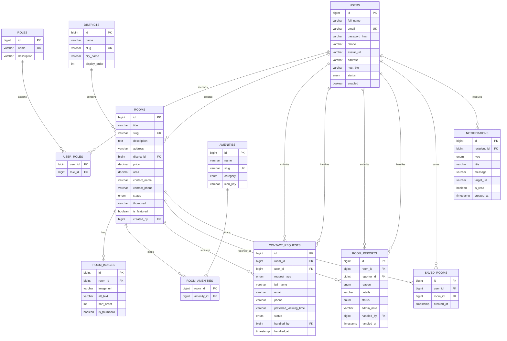

# Rental Room Website - Step 2 Database Design

## 1. Design goals

The database must support:

- public room listing and filtering
- room detail display with image gallery and amenities
- user authentication and profile management
- saved rooms for renters
- contact / room viewing requests
- room report moderation
- in-app notifications
- admin management for rooms, users, and requests
- simple dashboard statistics

At the same time, the schema should stay easy to explain and easy to map with Spring Data JPA.

## 2. Modeling decisions

### Keep only `USER` and `ADMIN`

To keep the graduation project manageable:

- `USER` represents renters and normal users; a normal user can also post rooms in the host area
- `ADMIN` represents the operator who manages room posts and contact requests

Instead of creating a separate `HOST` role, room ownership is stored through:

- `rooms.created_by`

The room also keeps display contact fields:

- `contact_name`
- `contact_phone`

This is a pragmatic choice for a solo project. Later, the project can be extended with a `HOST` role and an approval workflow if needed.

### Use a separate `districts` table

The main filter is district / area, so normalizing districts gives:

- better data consistency
- easier filtering
- simpler admin form controls

### Use `amenities` + `room_amenities`

Amenities are classic many-to-many data:

- one room has many amenities
- one amenity belongs to many rooms

This structure is clean for both filtering and room detail rendering.

### Keep `room_images` separate from `rooms`

Each room needs:

- a fast thumbnail for cards
- multiple images for the detail page

So:

- `rooms.thumbnail` supports listing performance
- `room_images` supports gallery images

### Allow `contact_requests.user_id` to be nullable

Current frontend scope can require login before sending a request, but keeping `user_id` nullable makes the schema more flexible:

- authenticated users can track request history
- future guest contact flow can be added without redesigning the table

### Keep saved rooms and notifications as separate tables

Saved rooms and notifications are user-specific features, so they stay outside the `rooms` table:

- `saved_rooms` stores which rooms a user saved
- `notifications` stores in-app notifications for contact requests and future events
- `room_reports` stores renter reports for inaccurate, unavailable, or suspicious listings

## 3. Main tables

### `roles`

Stores role definitions such as:

- `USER`
- `ADMIN`

### `users`

Stores account and profile information:

- full name
- email
- password hash
- phone
- avatar
- account status

### `user_roles`

Join table between users and roles.

Even though most users will only have one role, this structure matches Spring Security well and remains extensible.

### `districts`

Stores district / area data for room filtering.

### `amenities`

Stores reusable amenity definitions such as:

- Wi-Fi
- parking
- air conditioner
- private toilet

### `rooms`

Main business table. Stores:

- room title
- slug
- description
- address
- district
- price
- area
- status
- contact information
- thumbnail
- featured flag
- created by admin

### `room_images`

Stores additional room gallery images with display order.

### `room_amenities`

Join table between rooms and amenities.

### `contact_requests`

Stores contact or room-viewing requests from users.

Key fields:

- request type
- requester information
- message
- preferred viewing time
- processing status
- admin note
- handler admin

### `room_reports`

Stores user reports for room listings.

Key fields:

- report reason
- report details
- moderation status
- admin note
- handler admin

### `saved_rooms`

Stores renter bookmarks for rooms.

Key fields:

- user
- room
- created time

### `notifications`

Stores in-app notifications shown in the notification bell.

Key fields:

- recipient user
- notification type
- title
- message
- target URL
- read status

## 4. Relationship summary

- one `user` can have many `roles` through `user_roles`
- one `district` can have many `rooms`
- one `room` can have many `room_images`
- one `room` can have many `amenities` through `room_amenities`
- one `user` can create many `contact_requests`
- one `room` can receive many `contact_requests`
- one `admin user` can handle many `contact_requests`
- one `room` can receive many `room_reports`
- one `user` can submit many `room_reports`
- one `admin user` can handle many `room_reports`
- one `user` can save many `rooms` through `saved_rooms`
- one `room` can be saved by many `users`
- one `user` can receive many `notifications`

## 5. ERD

## 6. Table details

### `roles`

| Column | Type | Notes |
| --- | --- | --- |
| id | BIGINT | Primary key |
| name | VARCHAR(50) | Unique role name |
| description | VARCHAR(255) | Optional explanation |
| created_at | TIMESTAMP | Audit |
| updated_at | TIMESTAMP | Audit |

### `users`

| Column | Type | Notes |
| --- | --- | --- |
| id | BIGINT | Primary key |
| full_name | VARCHAR(120) | Required |
| email | VARCHAR(120) | Unique login identity |
| password_hash | VARCHAR(255) | BCrypt hash |
| phone | VARCHAR(20) | Optional contact |
| avatar_url | VARCHAR(255) | Optional profile image |
| address | VARCHAR(255) | Optional address / host location |
| host_bio | VARCHAR(500) | Optional host profile text |
| status | ENUM | `ACTIVE`, `INACTIVE`, `LOCKED` |
| enabled | BOOLEAN | Soft account toggle |
| created_at | TIMESTAMP | Audit |
| updated_at | TIMESTAMP | Audit |

### `districts`

| Column | Type | Notes |
| --- | --- | --- |
| id | BIGINT | Primary key |
| name | VARCHAR(100) | District name |
| slug | VARCHAR(120) | Unique slug |
| city_name | VARCHAR(100) | City display name |
| display_order | INT | UI sorting |
| created_at | TIMESTAMP | Audit |
| updated_at | TIMESTAMP | Audit |

### `amenities`

| Column | Type | Notes |
| --- | --- | --- |
| id | BIGINT | Primary key |
| name | VARCHAR(100) | Amenity label |
| slug | VARCHAR(120) | Unique slug |
| category | ENUM | `ROOM`, `BUILDING`, `SERVICE` |
| icon_key | VARCHAR(50) | Frontend icon mapping |
| created_at | TIMESTAMP | Audit |
| updated_at | TIMESTAMP | Audit |

### `rooms`

| Column | Type | Notes |
| --- | --- | --- |
| id | BIGINT | Primary key |
| title | VARCHAR(180) | Card and detail title |
| slug | VARCHAR(200) | Unique SEO-style key |
| description | TEXT | Full room description |
| address | VARCHAR(255) | Street-level address |
| district_id | BIGINT | FK to district |
| price | DECIMAL(12,2) | Monthly rental price |
| area | DECIMAL(6,2) | Room area in m2 |
| contact_name | VARCHAR(120) | Landlord/admin contact |
| contact_phone | VARCHAR(20) | Contact phone |
| status | ENUM | `AVAILABLE`, `FULL`, `HIDDEN` |
| thumbnail | VARCHAR(255) | Main image for cards |
| is_featured | BOOLEAN | Highlight on homepage |
| created_by | BIGINT | FK to the user/admin who created the room |
| created_at | TIMESTAMP | Audit |
| updated_at | TIMESTAMP | Audit |

### `saved_rooms`

| Column | Type | Notes |
| --- | --- | --- |
| id | BIGINT | Primary key |
| user_id | BIGINT | FK to user |
| room_id | BIGINT | FK to room |
| created_at | TIMESTAMP | When the room was saved |

The pair `(user_id, room_id)` is unique so a user cannot save the same room twice.

### `notifications`

| Column | Type | Notes |
| --- | --- | --- |
| id | BIGINT | Primary key |
| recipient_id | BIGINT | FK to recipient user |
| type | ENUM | Currently `NEW_CONTACT_REQUEST` |
| title | VARCHAR(200) | Notification title |
| message | VARCHAR(500) | Notification body |
| target_url | VARCHAR(255) | Frontend route opened from the bell |
| is_read | BOOLEAN | Read/unread status |
| created_at | TIMESTAMP | Audit |

### `room_images`

| Column | Type | Notes |
| --- | --- | --- |
| id | BIGINT | Primary key |
| room_id | BIGINT | FK to room |
| image_url | VARCHAR(255) | Gallery image URL |
| alt_text | VARCHAR(150) | Accessibility text |
| sort_order | INT | Display order |
| is_thumbnail | BOOLEAN | Indicates main image |
| created_at | TIMESTAMP | Audit |

### `contact_requests`

| Column | Type | Notes |
| --- | --- | --- |
| id | BIGINT | Primary key |
| room_id | BIGINT | Target room |
| user_id | BIGINT | Nullable requester user |
| request_type | ENUM | `CONTACT`, `VIEWING` |
| full_name | VARCHAR(120) | Requester name |
| email | VARCHAR(120) | Requester email |
| phone | VARCHAR(20) | Requester phone |
| message | VARCHAR(1000) | Optional note |
| preferred_viewing_time | VARCHAR(120) | Human-readable preference |
| status | ENUM | `PENDING`, `IN_PROGRESS`, `RESOLVED`, `CANCELLED` |
| admin_note | VARCHAR(500) | Admin processing note |
| handled_by | BIGINT | Nullable handler admin |
| handled_at | TIMESTAMP | When admin handled it |
| created_at | TIMESTAMP | Audit |
| updated_at | TIMESTAMP | Audit |

### `room_reports`

| Column | Type | Notes |
| --- | --- | --- |
| id | BIGINT | Primary key |
| room_id | BIGINT | Reported room |
| reporter_id | BIGINT | User who submitted the report |
| reason | ENUM | `WRONG_INFO`, `DUPLICATE`, `SCAM`, `UNAVAILABLE`, `INAPPROPRIATE`, `OTHER` |
| details | VARCHAR(1000) | Optional report details |
| status | ENUM | `NEW`, `REVIEWING`, `RESOLVED`, `DISMISSED` |
| admin_note | VARCHAR(500) | Admin processing note |
| handled_by | BIGINT | Nullable handler admin |
| handled_at | TIMESTAMP | When admin handled it |
| created_at | TIMESTAMP | Audit |
| updated_at | TIMESTAMP | Audit |

## 7. Index strategy

Important indexes are added for realistic filtering and admin queries:

- `users.email`
- `roles.name`
- `districts.slug`
- `amenities.slug`
- `rooms.slug`
- `rooms(status, district_id, price)`
- `rooms(area)`
- `rooms(created_at)`
- `contact_requests(user_id, status)`
- `contact_requests(room_id, created_at)`
- `contact_requests(room_id, status, created_at)`
- `room_reports(status, created_at)`
- `room_reports(reason)`
- `room_reports(room_id, created_at)`
- `room_reports(reporter_id, created_at)`
- `saved_rooms(user_id, room_id)` unique
- `saved_rooms(user_id, created_at)`
- `notifications(recipient_id, is_read, created_at)`

These are enough for a graduation project without over-optimizing too early.

## 8. Seed data strategy

The seed data is designed to support demo flows immediately:

- 2 roles
- 3 users
- 5 districts
- 12 amenities
- 6 room posts
- 12 room gallery images
- room-amenity mappings
- 4 contact requests
- 2 room reports
- 4 saved rooms
- 3 notifications

Demo login accounts:

- `admin@homi.vn` / `admin123`
- `an.nguyen@example.com` / `123456`
- `binh.tran@example.com` / `123456`

## 9. Why this schema is a good fit

This schema is suitable for the project because it is:

- normalized enough to be professional
- small enough to implement alone
- easy to map into JPA entities
- strong enough for CRUD, filtering, and admin flows
- easy to defend in a graduation presentation

## 10. Current implementation note

The current backend maps this schema into:

- Spring Boot package structure
- JPA entities
- repositories
- services
- REST controllers
- JWT authentication flow

Fresh local setup should import `01_schema.sql` and then `02_seed.sql`. Existing databases created before saved rooms, notifications, and room reports were added should also run `05_saved_rooms_notifications.sql` and `06_room_reports.sql` once.
