# 05. Luồng hoạt động hệ thống

## 1. Luồng đăng ký bằng email và OTP

### Mô tả

Người dùng nhập thông tin đăng ký. Backend tạo tài khoản tạm ở trạng thái chưa kích hoạt, sinh OTP và gửi email nếu cấu hình mail được bật. Sau khi người dùng nhập OTP hợp lệ, backend kích hoạt tài khoản và cấp token.

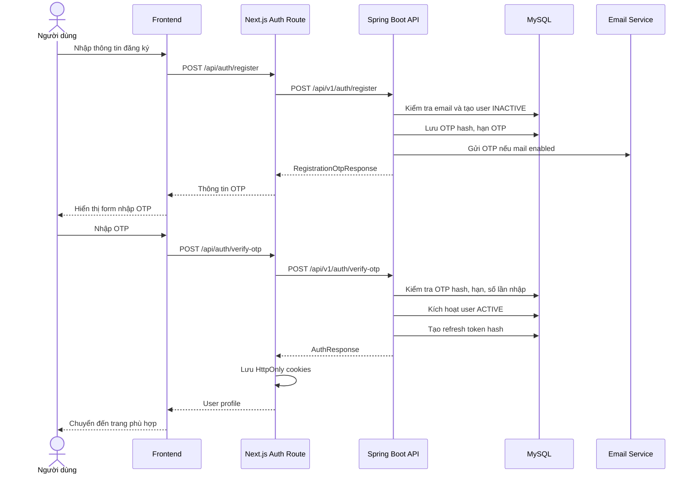

### Luồng lỗi

- Email đã tồn tại: backend trả lỗi nghiệp vụ.
- OTP sai: tăng số lần nhập sai.
- OTP hết hạn: yêu cầu gửi lại OTP.
- Vượt số lần gửi lại: backend chặn resend.
- Mail chưa cấu hình: chưa đủ thông tin để đánh giá trong môi trường production; code có xử lý báo lỗi/ghi log tùy cấu hình.

## 2. Luồng đăng nhập

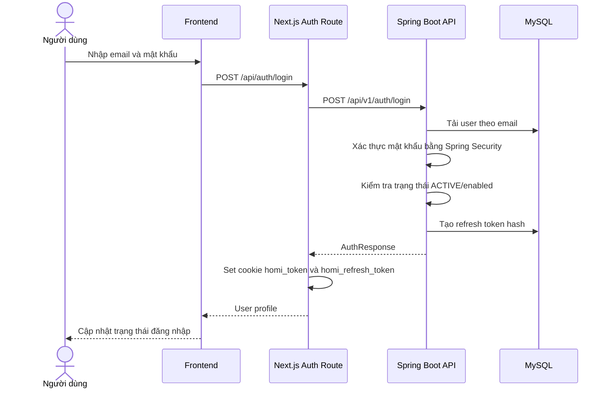

### Refresh phiên đăng nhập

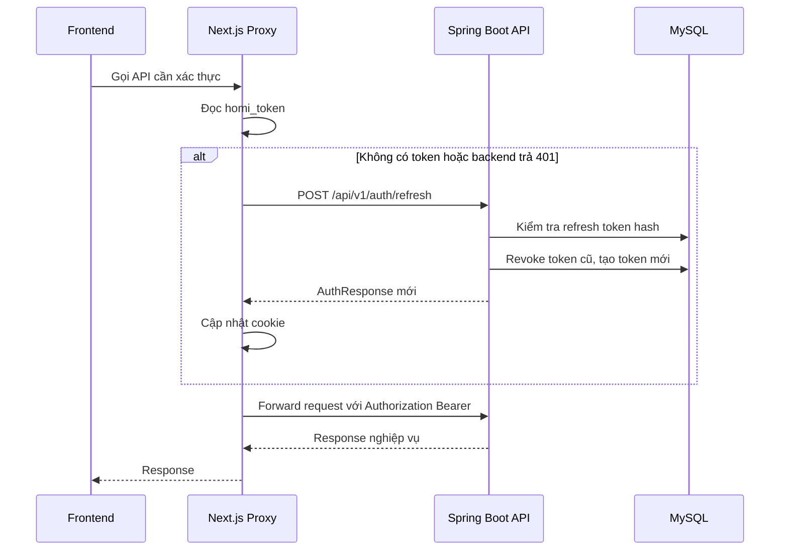

## 3. Luồng tìm kiếm và xem chi tiết phòng

### Tìm kiếm/lọc phòng

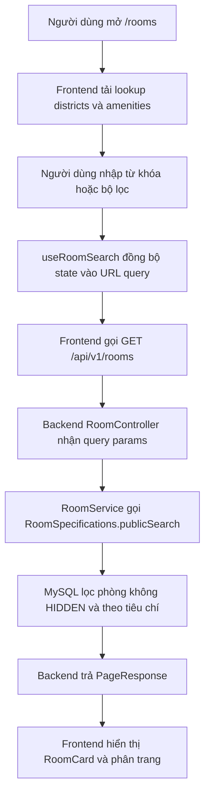

### Xem chi tiết phòng

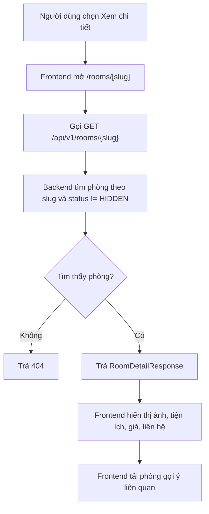

## 4. Luồng lưu phòng

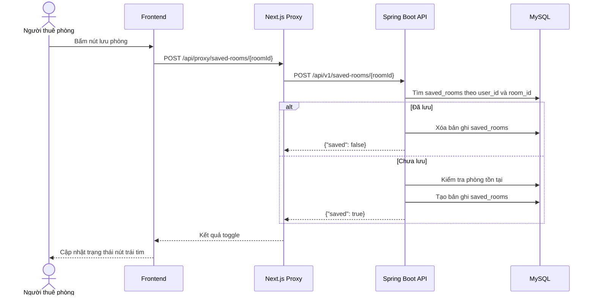

### Xem danh sách phòng đã lưu

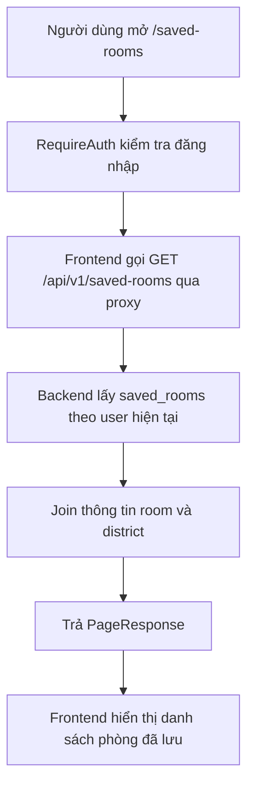

## 5. Luồng gửi yêu cầu xem phòng/liên hệ

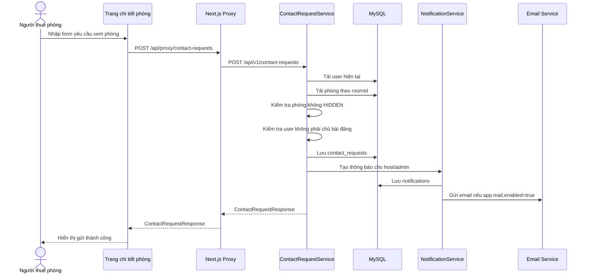

### Luồng thay thế/lỗi

- Chưa đăng nhập: frontend yêu cầu đăng nhập trước khi gửi.
- Phòng không tồn tại hoặc bị ẩn: backend trả lỗi không tìm thấy.
- Người gửi là chủ bài đăng: backend trả lỗi nghiệp vụ.
- Dữ liệu form sai định dạng: backend trả validation error.

## 6. Luồng chủ trọ đăng và quản lý bài viết

### Tạo bài đăng

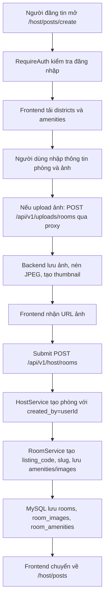

### Quản lý bài đăng

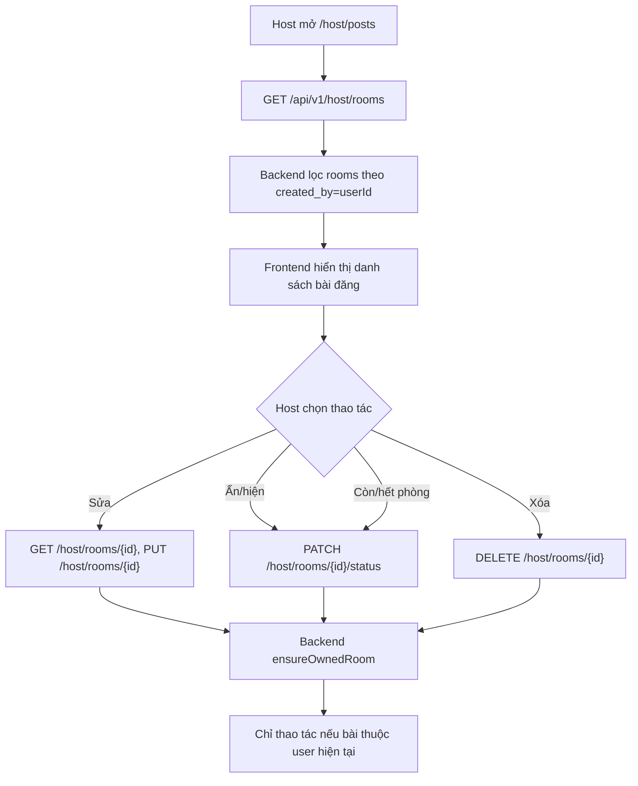

### Quản lý khách liên hệ

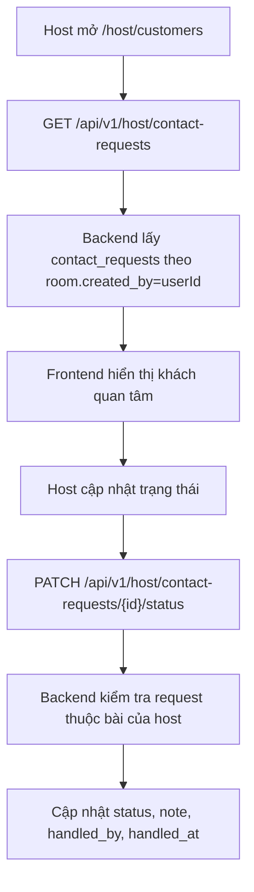

## 7. Luồng admin quản lý hệ thống

### Truy cập admin

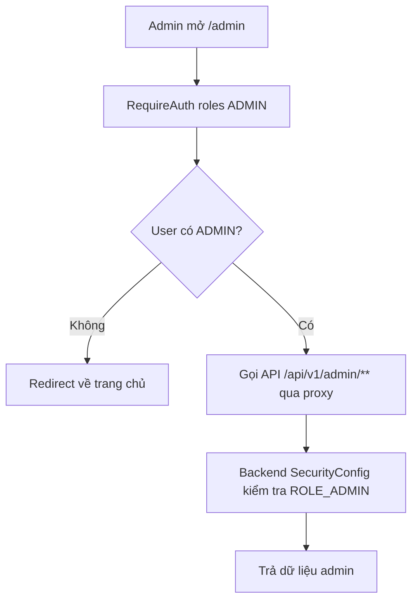

### Dashboard admin

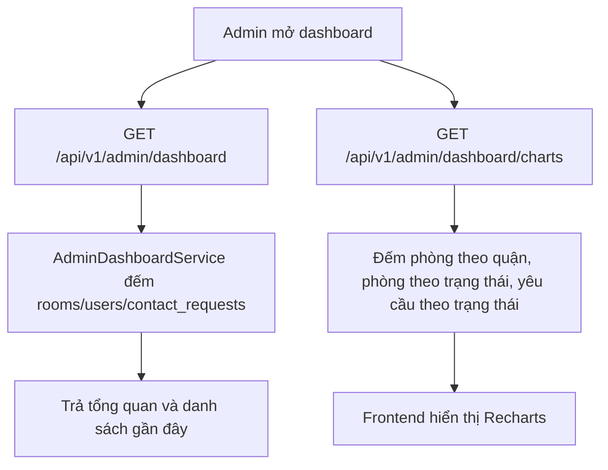

### Quản lý phòng

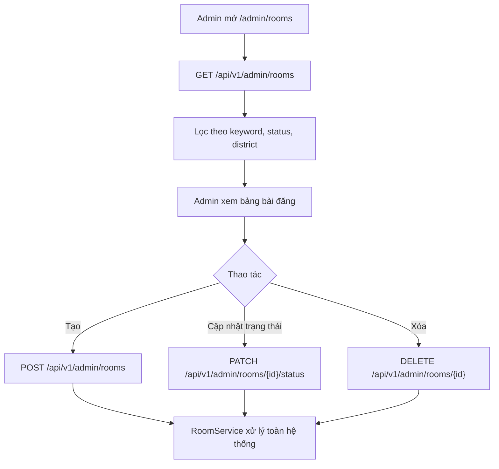

### Quản lý yêu cầu liên hệ

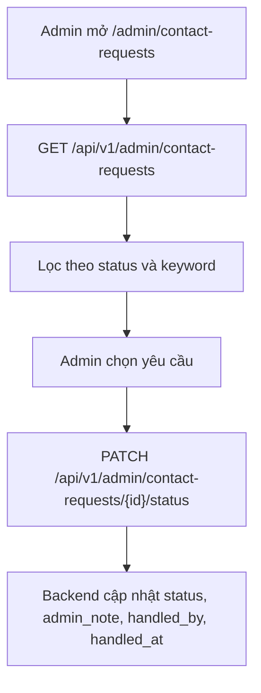

### Quản lý người dùng

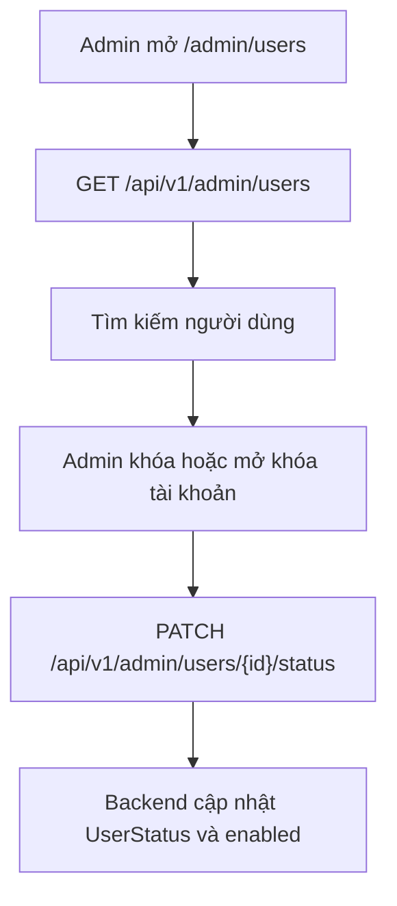

### Quản lý báo cáo tin đăng

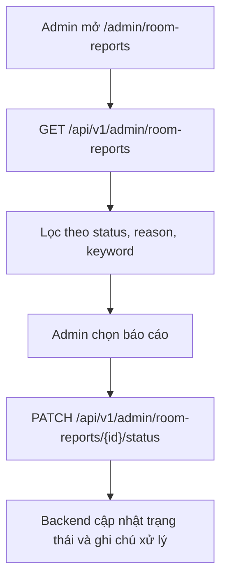

## 8. Luồng dữ liệu tổng quát

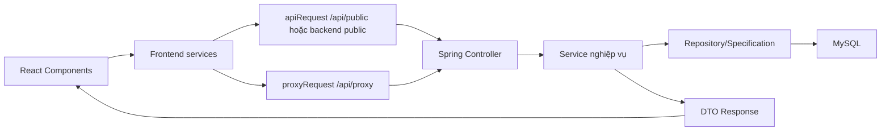

## 9. Ghi chú về giới hạn hiện tại

- Khu host chưa dùng role `HOST` riêng; quyền quản lý dựa trên đăng nhập và `created_by`.
- Chưa thấy luồng duyệt bài trước khi công khai.
- Chưa thấy luồng thanh toán hoặc gói nâng cấp tin.
- Chưa đủ thông tin để đánh giá luồng vận hành production như backup, monitoring, CI/CD.

