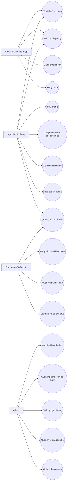

# 06. Use Case hệ thống Homi

## 1. Danh sách actor

| Actor | Mô tả |
|---|---|
| Khách chưa đăng nhập | Người truy cập website chưa có phiên đăng nhập. Có thể xem thông tin công khai nhưng không thể thực hiện thao tác cá nhân hóa. |
| Người thuê phòng | Người dùng đã đăng nhập, có nhu cầu tìm phòng, lưu phòng, gửi yêu cầu xem phòng/liên hệ và theo dõi lịch sử. |
| Chủ trọ/người đăng tin | Người dùng đã đăng nhập và sử dụng khu host để đăng, sửa, quản lý phòng của mình. Hiện chưa có role `HOST` riêng trong backend; quyền sở hữu dựa trên `created_by`. |
| Admin | Người dùng có role `ADMIN`, có quyền quản lý dữ liệu toàn hệ thống. |

## 2. Sơ đồ Use Case tổng quát

Ghi chú: Mermaid trong một số môi trường không hỗ trợ trực tiếp `usecaseDiagram`, nên tài liệu dùng `flowchart` để mô phỏng sơ đồ Use Case.

## 3. Danh sách use case theo actor

### 3.1. Khách chưa đăng nhập

- UC01: Xem trang chủ.
- UC02: Tìm kiếm và lọc phòng.
- UC03: Xem chi tiết phòng.
- UC04: Đăng ký tài khoản.
- UC05: Đăng nhập.

### 3.2. Người thuê phòng

- UC06: Cập nhật hồ sơ cá nhân.
- UC07: Đổi mật khẩu.
- UC08: Lưu hoặc bỏ lưu phòng.
- UC09: Xem danh sách phòng đã lưu.
- UC10: Gửi yêu cầu xem phòng/liên hệ.
- UC11: Xem lịch sử yêu cầu liên hệ.
- UC12: Báo cáo tin đăng.
- UC13: Xem và đánh dấu thông báo.

### 3.3. Chủ trọ/người đăng tin

- UC14: Xem dashboard chủ trọ.
- UC15: Tạo bài đăng phòng.
- UC16: Cập nhật bài đăng.
- UC17: Cập nhật trạng thái bài đăng.
- UC18: Xóa bài đăng.
- UC19: Quản lý khách liên hệ.
- UC20: Cập nhật hồ sơ người cho thuê.

### 3.4. Admin

- UC21: Xem dashboard admin.
- UC22: Quản lý bài đăng toàn hệ thống.
- UC23: Quản lý yêu cầu liên hệ.
- UC24: Quản lý báo cáo tin đăng.
- UC25: Quản lý người dùng.

## 4. Mô tả chi tiết use case

### UC01. Xem trang chủ

| Thuộc tính | Nội dung |
|---|---|
| Tên use case | Xem trang chủ |
| Actor | Khách chưa đăng nhập, Người thuê phòng, Chủ trọ/người đăng tin, Admin |
| Mục tiêu | Xem thông tin tổng quan về Homi, tìm kiếm nhanh và truy cập các khu chức năng chính. |
| Tiền điều kiện | Website frontend hoạt động. |
| Luồng chính | 1. Actor mở trang chủ. 2. Frontend hiển thị hero search, phòng nổi bật, thông tin giới thiệu. 3. Actor chọn tìm phòng, đăng nhập, đăng ký hoặc đăng tin. |
| Luồng thay thế/lỗi | Nếu API phòng nổi bật lỗi, frontend hiển thị trạng thái lỗi hoặc không hiển thị danh sách phòng nổi bật. |
| Kết quả sau xử lý | Actor nắm được chức năng chính và có thể chuyển sang bước tìm phòng hoặc xác thực. |

### UC02. Tìm kiếm và lọc phòng

| Thuộc tính | Nội dung |
|---|---|
| Tên use case | Tìm kiếm và lọc phòng |
| Actor | Khách chưa đăng nhập, Người thuê phòng |
| Mục tiêu | Tìm phòng phù hợp theo nhu cầu. |
| Tiền điều kiện | Có dữ liệu phòng trong hệ thống. |
| Luồng chính | 1. Actor mở trang `/rooms`. 2. Frontend tải danh sách quận và tiện ích. 3. Actor nhập từ khóa hoặc chọn bộ lọc. 4. Frontend gọi `GET /api/v1/rooms`. 5. Backend lọc phòng theo điều kiện và chỉ trả phòng không bị ẩn. 6. Frontend hiển thị danh sách, số kết quả và phân trang. |
| Luồng thay thế/lỗi | Nếu không có kết quả, frontend hiển thị empty state. Nếu API lỗi, frontend hiển thị cảnh báo. |
| Kết quả sau xử lý | Actor có danh sách phòng phù hợp hoặc biết rằng chưa có phòng phù hợp. |

### UC03. Xem chi tiết phòng

| Thuộc tính | Nội dung |
|---|---|
| Tên use case | Xem chi tiết phòng |
| Actor | Khách chưa đăng nhập, Người thuê phòng |
| Mục tiêu | Xem đầy đủ thông tin phòng trước khi liên hệ. |
| Tiền điều kiện | Phòng tồn tại và không bị ẩn. |
| Luồng chính | 1. Actor chọn một phòng. 2. Frontend mở `/rooms/{slug}`. 3. Frontend gọi `GET /api/v1/rooms/{slug}`. 4. Backend trả thông tin chi tiết phòng. 5. Frontend hiển thị ảnh, giá, diện tích, tiện ích, số liên hệ, bản đồ và form liên hệ. |
| Luồng thay thế/lỗi | Nếu phòng không tồn tại hoặc bị ẩn, backend trả 404 và frontend hiển thị thông báo không tải được phòng. |
| Kết quả sau xử lý | Actor xem được thông tin phòng và có thể gọi điện, đăng nhập để gửi yêu cầu hoặc lưu phòng. |

### UC04. Đăng ký tài khoản

| Thuộc tính | Nội dung |
|---|---|
| Tên use case | Đăng ký tài khoản |
| Actor | Khách chưa đăng nhập |
| Mục tiêu | Tạo tài khoản người dùng để sử dụng chức năng cá nhân hóa. |
| Tiền điều kiện | Email chưa tồn tại trong hệ thống. |
| Luồng chính | 1. Actor mở trang đăng ký. 2. Nhập họ tên, email, số điện thoại, mật khẩu. 3. Frontend gọi `POST /api/auth/register`. 4. Backend tạo tài khoản `INACTIVE`, sinh OTP. 5. Actor nhập OTP. 6. Frontend gọi `POST /api/auth/verify-otp`. 7. Backend xác minh OTP, kích hoạt tài khoản và cấp token. |
| Luồng thay thế/lỗi | Email đã tồn tại, OTP sai, OTP hết hạn, vượt số lần gửi lại OTP hoặc mail chưa cấu hình. |
| Kết quả sau xử lý | Tài khoản được kích hoạt và actor đăng nhập vào hệ thống. |

### UC05. Đăng nhập

| Thuộc tính | Nội dung |
|---|---|
| Tên use case | Đăng nhập |
| Actor | Khách chưa đăng nhập |
| Mục tiêu | Tạo phiên đăng nhập hợp lệ. |
| Tiền điều kiện | Tài khoản tồn tại, đã kích hoạt và không bị khóa. |
| Luồng chính | 1. Actor nhập email/mật khẩu hoặc dùng Google. 2. Frontend gọi route BFF auth. 3. BFF gọi backend. 4. Backend xác thực và cấp token. 5. BFF lưu token vào HttpOnly cookie. 6. Frontend cập nhật trạng thái đăng nhập. |
| Luồng thay thế/lỗi | Sai email/mật khẩu, tài khoản chưa xác minh email, tài khoản bị khóa, Google chưa cấu hình hoặc token Google không hợp lệ. |
| Kết quả sau xử lý | Actor trở thành người dùng đã đăng nhập. |

### UC06. Cập nhật hồ sơ cá nhân

| Thuộc tính | Nội dung |
|---|---|
| Tên use case | Cập nhật hồ sơ cá nhân |
| Actor | Người thuê phòng, Chủ trọ/người đăng tin, Admin |
| Mục tiêu | Cập nhật thông tin cá nhân phục vụ liên hệ. |
| Tiền điều kiện | Actor đã đăng nhập. |
| Luồng chính | 1. Actor mở trang hồ sơ. 2. Frontend tải `GET /api/v1/users/me`. 3. Actor cập nhật họ tên, số điện thoại, avatar. 4. Frontend gọi `PUT /api/v1/users/me`. 5. Backend validate và lưu dữ liệu. |
| Luồng thay thế/lỗi | Dữ liệu không hợp lệ hoặc phiên đăng nhập hết hạn. |
| Kết quả sau xử lý | Hồ sơ cá nhân được cập nhật. |

### UC07. Đổi mật khẩu

| Thuộc tính | Nội dung |
|---|---|
| Tên use case | Đổi mật khẩu |
| Actor | Người thuê phòng, Chủ trọ/người đăng tin, Admin |
| Mục tiêu | Thay đổi mật khẩu tài khoản. |
| Tiền điều kiện | Actor đã đăng nhập và có mật khẩu hiện tại. |
| Luồng chính | 1. Actor nhập mật khẩu hiện tại và mật khẩu mới. 2. Frontend gọi `PUT /api/v1/users/me/password`. 3. Backend kiểm tra mật khẩu hiện tại. 4. Backend mã hóa và lưu mật khẩu mới. |
| Luồng thay thế/lỗi | Mật khẩu hiện tại sai, mật khẩu mới trùng mật khẩu cũ, mật khẩu mới không đủ điều kiện. |
| Kết quả sau xử lý | Mật khẩu tài khoản được thay đổi. |

### UC08. Lưu hoặc bỏ lưu phòng

| Thuộc tính | Nội dung |
|---|---|
| Tên use case | Lưu hoặc bỏ lưu phòng |
| Actor | Người thuê phòng |
| Mục tiêu | Ghi nhớ phòng quan tâm để xem lại. |
| Tiền điều kiện | Actor đã đăng nhập, phòng tồn tại. |
| Luồng chính | 1. Actor bấm nút trái tim trên phòng. 2. Frontend gọi `POST /api/v1/saved-rooms/{roomId}` qua proxy. 3. Backend kiểm tra bản ghi saved room. 4. Nếu đã lưu thì xóa; nếu chưa lưu thì tạo mới. 5. Backend trả trạng thái `saved`. |
| Luồng thay thế/lỗi | Actor chưa đăng nhập thì nút lưu không hiển thị; phòng không tồn tại thì backend trả lỗi. |
| Kết quả sau xử lý | Phòng được lưu hoặc bỏ lưu. |

### UC09. Xem danh sách phòng đã lưu

| Thuộc tính | Nội dung |
|---|---|
| Tên use case | Xem danh sách phòng đã lưu |
| Actor | Người thuê phòng |
| Mục tiêu | Xem lại các phòng đã quan tâm. |
| Tiền điều kiện | Actor đã đăng nhập. |
| Luồng chính | 1. Actor mở `/saved-rooms`. 2. Frontend gọi `GET /api/v1/saved-rooms`. 3. Backend trả danh sách phòng đã lưu theo user. 4. Frontend hiển thị danh sách và phân trang. |
| Luồng thay thế/lỗi | Nếu danh sách rỗng, frontend hiển thị empty state. Nếu phiên hết hạn, chuyển đăng nhập. |
| Kết quả sau xử lý | Actor xem được danh sách phòng đã lưu. |

### UC10. Gửi yêu cầu xem phòng/liên hệ

| Thuộc tính | Nội dung |
|---|---|
| Tên use case | Gửi yêu cầu xem phòng/liên hệ |
| Actor | Người thuê phòng |
| Mục tiêu | Gửi thông tin liên hệ đến chủ phòng/admin. |
| Tiền điều kiện | Actor đã đăng nhập, phòng tồn tại và không bị ẩn. |
| Luồng chính | 1. Actor mở chi tiết phòng. 2. Nhập form yêu cầu. 3. Frontend gọi `POST /api/v1/contact-requests`. 4. Backend kiểm tra phòng và user. 5. Backend lưu yêu cầu. 6. Backend tạo thông báo cho host/admin. 7. Frontend hiển thị gửi thành công. |
| Luồng thay thế/lỗi | Người gửi là chủ bài đăng, phòng bị ẩn, dữ liệu form sai hoặc phiên hết hạn. |
| Kết quả sau xử lý | Yêu cầu được lưu trong `contact_requests`, host/admin có thể xử lý. |

### UC11. Xem lịch sử yêu cầu liên hệ

| Thuộc tính | Nội dung |
|---|---|
| Tên use case | Xem lịch sử yêu cầu liên hệ |
| Actor | Người thuê phòng |
| Mục tiêu | Theo dõi các yêu cầu đã gửi và trạng thái xử lý. |
| Tiền điều kiện | Actor đã đăng nhập. |
| Luồng chính | 1. Actor mở `/contact-history`. 2. Frontend gọi `GET /api/v1/contact-requests/me`. 3. Backend lấy yêu cầu theo user hiện tại. 4. Frontend hiển thị trạng thái, ghi chú và thời gian tạo. |
| Luồng thay thế/lỗi | Không có yêu cầu thì hiển thị empty state; phiên hết hạn thì chuyển đăng nhập. |
| Kết quả sau xử lý | Actor nắm được lịch sử liên hệ của mình. |

### UC12. Báo cáo tin đăng

| Thuộc tính | Nội dung |
|---|---|
| Tên use case | Báo cáo tin đăng |
| Actor | Người thuê phòng |
| Mục tiêu | Gửi phản ánh khi tin đăng có vấn đề. |
| Tiền điều kiện | Actor đã đăng nhập, phòng tồn tại và không bị ẩn. |
| Luồng chính | 1. Actor chọn lý do báo cáo và nhập chi tiết. 2. Frontend gọi `POST /api/v1/room-reports`. 3. Backend kiểm tra báo cáo trùng đang mở. 4. Backend lưu báo cáo ở trạng thái `NEW`. |
| Luồng thay thế/lỗi | Đã có báo cáo đang mở cho cùng phòng, phòng bị ẩn, dữ liệu không hợp lệ. |
| Kết quả sau xử lý | Báo cáo được lưu để admin xem xét. |

### UC13. Xem và đánh dấu thông báo

| Thuộc tính | Nội dung |
|---|---|
| Tên use case | Xem và đánh dấu thông báo |
| Actor | Người thuê phòng, Chủ trọ/người đăng tin, Admin |
| Mục tiêu | Theo dõi thông báo trong hệ thống. |
| Tiền điều kiện | Actor đã đăng nhập. |
| Luồng chính | 1. Frontend poll unread count. 2. Actor mở chuông thông báo. 3. Frontend gọi `GET /api/v1/notifications`. 4. Actor chọn thông báo hoặc đánh dấu tất cả đã đọc. |
| Luồng thay thế/lỗi | Nếu API lỗi, frontend bỏ qua lỗi polling. |
| Kết quả sau xử lý | Thông báo được hiển thị hoặc đánh dấu đã đọc. |

### UC14. Xem dashboard chủ trọ

| Thuộc tính | Nội dung |
|---|---|
| Tên use case | Xem dashboard chủ trọ |
| Actor | Chủ trọ/người đăng tin |
| Mục tiêu | Xem tổng quan bài đăng và khách quan tâm. |
| Tiền điều kiện | Actor đã đăng nhập. |
| Luồng chính | 1. Actor mở `/host/dashboard`. 2. Frontend gọi `GET /api/v1/host/dashboard`. 3. Backend thống kê bài đăng theo `created_by`. 4. Frontend hiển thị chỉ số và liên hệ mới nhất. |
| Luồng thay thế/lỗi | Phiên đăng nhập hết hạn hoặc API lỗi. |
| Kết quả sau xử lý | Actor nắm tình hình bài đăng của mình. |

### UC15. Tạo bài đăng phòng

| Thuộc tính | Nội dung |
|---|---|
| Tên use case | Tạo bài đăng phòng |
| Actor | Chủ trọ/người đăng tin |
| Mục tiêu | Đăng phòng mới lên hệ thống. |
| Tiền điều kiện | Actor đã đăng nhập. |
| Luồng chính | 1. Actor mở form tạo bài. 2. Nhập thông tin phòng, giá, diện tích, địa chỉ, liên hệ, tiện ích, ảnh. 3. Upload ảnh nếu có. 4. Frontend gọi `POST /api/v1/host/rooms`. 5. Backend tạo room với `created_by` là user hiện tại. |
| Luồng thay thế/lỗi | Dữ liệu không hợp lệ, quận/tiện ích không tồn tại, upload ảnh lỗi. |
| Kết quả sau xử lý | Bài đăng mới được lưu và hiển thị theo trạng thái đã chọn. |

### UC16. Cập nhật bài đăng

| Thuộc tính | Nội dung |
|---|---|
| Tên use case | Cập nhật bài đăng |
| Actor | Chủ trọ/người đăng tin |
| Mục tiêu | Sửa thông tin bài đăng của mình. |
| Tiền điều kiện | Actor đã đăng nhập và là chủ sở hữu bài đăng. |
| Luồng chính | 1. Actor mở form sửa bài. 2. Frontend gọi `GET /api/v1/host/rooms/{roomId}`. 3. Backend kiểm tra ownership. 4. Actor sửa thông tin. 5. Frontend gọi `PUT /api/v1/host/rooms/{roomId}`. 6. Backend cập nhật dữ liệu. |
| Luồng thay thế/lỗi | Bài không thuộc user hiện tại, dữ liệu không hợp lệ. |
| Kết quả sau xử lý | Bài đăng được cập nhật. |

### UC17. Cập nhật trạng thái bài đăng

| Thuộc tính | Nội dung |
|---|---|
| Tên use case | Cập nhật trạng thái bài đăng |
| Actor | Chủ trọ/người đăng tin |
| Mục tiêu | Đánh dấu còn phòng, hết phòng hoặc ẩn bài. |
| Tiền điều kiện | Actor đã đăng nhập và sở hữu bài đăng. |
| Luồng chính | 1. Actor chọn trạng thái mới. 2. Frontend gọi `PATCH /api/v1/host/rooms/{roomId}/status`. 3. Backend kiểm tra ownership. 4. Backend lưu trạng thái mới. |
| Luồng thay thế/lỗi | Bài không thuộc user hiện tại hoặc trạng thái không hợp lệ. |
| Kết quả sau xử lý | Trạng thái bài đăng được thay đổi. |

### UC18. Xóa bài đăng

| Thuộc tính | Nội dung |
|---|---|
| Tên use case | Xóa bài đăng |
| Actor | Chủ trọ/người đăng tin |
| Mục tiêu | Xóa bài đăng không còn sử dụng. |
| Tiền điều kiện | Actor đã đăng nhập và sở hữu bài đăng. |
| Luồng chính | 1. Actor chọn xóa và xác nhận. 2. Frontend gọi `DELETE /api/v1/host/rooms/{roomId}`. 3. Backend kiểm tra ownership. 4. Backend xóa dữ liệu liên quan như yêu cầu liên hệ, báo cáo, saved room rồi xóa room. |
| Luồng thay thế/lỗi | Bài không thuộc user hiện tại hoặc backend lỗi ràng buộc dữ liệu. |
| Kết quả sau xử lý | Bài đăng bị xóa khỏi hệ thống. |

### UC19. Quản lý khách liên hệ

| Thuộc tính | Nội dung |
|---|---|
| Tên use case | Quản lý khách liên hệ |
| Actor | Chủ trọ/người đăng tin |
| Mục tiêu | Theo dõi và xử lý khách quan tâm bài đăng của mình. |
| Tiền điều kiện | Actor đã đăng nhập. |
| Luồng chính | 1. Actor mở `/host/customers`. 2. Frontend gọi `GET /api/v1/host/contact-requests`. 3. Backend lấy yêu cầu theo `room.created_by`. 4. Actor cập nhật trạng thái. 5. Backend lưu trạng thái và người xử lý. |
| Luồng thay thế/lỗi | Yêu cầu không thuộc bài của actor hoặc trạng thái không hợp lệ. |
| Kết quả sau xử lý | Yêu cầu liên hệ được cập nhật. |

### UC20. Cập nhật hồ sơ người cho thuê

| Thuộc tính | Nội dung |
|---|---|
| Tên use case | Cập nhật hồ sơ người cho thuê |
| Actor | Chủ trọ/người đăng tin |
| Mục tiêu | Cập nhật thông tin giới thiệu và liên hệ của người đăng tin. |
| Tiền điều kiện | Actor đã đăng nhập. |
| Luồng chính | 1. Actor mở `/host/profile`. 2. Frontend tải profile host. 3. Actor cập nhật họ tên, số điện thoại, avatar, địa chỉ, mô tả. 4. Backend validate và lưu vào bảng `users`. |
| Luồng thay thế/lỗi | Dữ liệu không hợp lệ hoặc phiên hết hạn. |
| Kết quả sau xử lý | Hồ sơ host được cập nhật. |

### UC21. Xem dashboard admin

| Thuộc tính | Nội dung |
|---|---|
| Tên use case | Xem dashboard admin |
| Actor | Admin |
| Mục tiêu | Theo dõi tình hình tổng quan hệ thống. |
| Tiền điều kiện | Actor đã đăng nhập và có role `ADMIN`. |
| Luồng chính | 1. Admin mở `/admin`. 2. Frontend kiểm tra role. 3. Frontend gọi `GET /api/v1/admin/dashboard` và `/charts`. 4. Backend thống kê dữ liệu. 5. Frontend hiển thị card, bảng và biểu đồ. |
| Luồng thay thế/lỗi | Không có role admin thì frontend redirect; backend cũng từ chối `/api/v1/admin/**`. |
| Kết quả sau xử lý | Admin xem được tổng quan hệ thống. |

### UC22. Quản lý bài đăng toàn hệ thống

| Thuộc tính | Nội dung |
|---|---|
| Tên use case | Quản lý bài đăng toàn hệ thống |
| Actor | Admin |
| Mục tiêu | Kiểm soát toàn bộ bài đăng phòng trọ. |
| Tiền điều kiện | Actor có role `ADMIN`. |
| Luồng chính | 1. Admin mở `/admin/rooms`. 2. Tìm kiếm/lọc phòng. 3. Tạo bài mới hoặc cập nhật trạng thái/xóa bài. 4. Backend xử lý qua admin room API. |
| Luồng thay thế/lỗi | Dữ liệu tạo phòng không hợp lệ, phòng không tồn tại hoặc backend lỗi. |
| Kết quả sau xử lý | Dữ liệu bài đăng toàn hệ thống được cập nhật. |

### UC23. Quản lý yêu cầu liên hệ

| Thuộc tính | Nội dung |
|---|---|
| Tên use case | Quản lý yêu cầu liên hệ |
| Actor | Admin |
| Mục tiêu | Theo dõi và xử lý yêu cầu liên hệ của người thuê. |
| Tiền điều kiện | Actor có role `ADMIN`. |
| Luồng chính | 1. Admin mở `/admin/contact-requests`. 2. Lọc/tìm yêu cầu. 3. Chọn một yêu cầu. 4. Cập nhật trạng thái và ghi chú. 5. Backend lưu người xử lý và thời gian xử lý. |
| Luồng thay thế/lỗi | Yêu cầu không tồn tại hoặc dữ liệu không hợp lệ. |
| Kết quả sau xử lý | Yêu cầu liên hệ được cập nhật trạng thái. |

### UC24. Quản lý báo cáo tin đăng

| Thuộc tính | Nội dung |
|---|---|
| Tên use case | Quản lý báo cáo tin đăng |
| Actor | Admin |
| Mục tiêu | Kiểm tra các phản ánh về chất lượng tin đăng. |
| Tiền điều kiện | Actor có role `ADMIN`. |
| Luồng chính | 1. Admin mở `/admin/room-reports`. 2. Lọc theo trạng thái/lý do/từ khóa. 3. Chọn báo cáo. 4. Cập nhật trạng thái và ghi chú xử lý. |
| Luồng thay thế/lỗi | Báo cáo không tồn tại hoặc trạng thái không hợp lệ. |
| Kết quả sau xử lý | Báo cáo được xử lý hoặc bỏ qua. |

### UC25. Quản lý người dùng

| Thuộc tính | Nội dung |
|---|---|
| Tên use case | Quản lý người dùng |
| Actor | Admin |
| Mục tiêu | Theo dõi tài khoản và khóa/mở khóa người dùng khi cần. |
| Tiền điều kiện | Actor có role `ADMIN`. |
| Luồng chính | 1. Admin mở `/admin/users`. 2. Tìm kiếm người dùng. 3. Chọn khóa hoặc mở khóa. 4. Backend cập nhật `UserStatus` và `enabled`. |
| Luồng thay thế/lỗi | User không tồn tại. Frontend không cho khóa tài khoản admin qua nút thao tác. |
| Kết quả sau xử lý | Trạng thái tài khoản được cập nhật. |

## 5. Ghi chú nghiệp vụ

- Actor “Chủ trọ/người đăng tin” là actor nghiệp vụ. Trong backend hiện chưa có role `HOST`, nên tài liệu cần phân biệt giữa actor nghiệp vụ và role kỹ thuật.
- Actor Admin là role kỹ thuật rõ ràng trong bảng `roles` và enum `RoleName.ADMIN`.
- Các use case yêu cầu đăng nhập đều phụ thuộc vào JWT/refresh token và Next.js proxy.
- Các use case admin phụ thuộc cả frontend guard và backend security rule.

