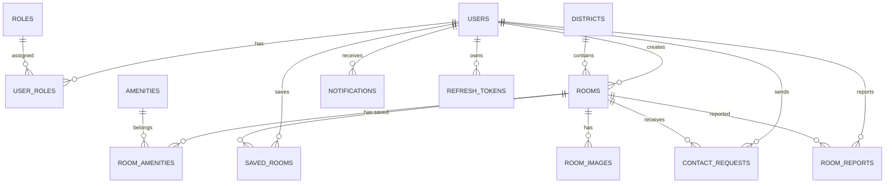

# 07. Database và API

## 1. Tổng quan database

Homi sử dụng MySQL, database mặc định là `rental_room_db`. Backend sử dụng Spring Data JPA/Hibernate để ánh xạ các entity Java với bảng dữ liệu. Schema chính nằm tại `database/mysql/01_schema.sql`, các file sau đó đóng vai trò seed hoặc migration bổ sung.

Các nhóm dữ liệu chính:

- Tài khoản và phân quyền: `users`, `roles`, `user_roles`.
- Phòng trọ: `rooms`, `room_images`, `room_amenities`.
- Dữ liệu tra cứu: `districts`, `amenities`.
- Tương tác người thuê: `saved_rooms`, `contact_requests`.
- Quản trị/chất lượng dữ liệu: `room_reports`, `notifications`.
- Phiên đăng nhập: `refresh_tokens`.

## 2. Sơ đồ quan hệ dữ liệu tổng quan

## 3. Bảng dữ liệu chính

### 3.1. `roles`

Lưu danh sách vai trò trong hệ thống.

| Trường | Kiểu | Ý nghĩa |
|---|---|---|
| `id` | BIGINT | Khóa chính. |
| `name` | VARCHAR(50) | Tên role, hiện có `USER`, `ADMIN`. |
| `description` | VARCHAR(255) | Mô tả vai trò. |
| `created_at` | TIMESTAMP | Thời điểm tạo. |
| `updated_at` | TIMESTAMP | Thời điểm cập nhật. |

Ghi chú: hiện chưa có role `HOST`. Chủ trọ/người đăng tin là actor nghiệp vụ, chưa phải role kỹ thuật riêng.

### 3.2. `users`

Lưu thông tin tài khoản người dùng.

| Trường | Kiểu | Ý nghĩa |
|---|---|---|
| `id` | BIGINT | Khóa chính. |
| `full_name` | VARCHAR(120) | Họ tên người dùng. |
| `email` | VARCHAR(120) | Email đăng nhập, unique. |
| `password_hash` | VARCHAR(255) | Mật khẩu đã mã hóa bằng BCrypt hoặc password opaque cho Google user. |
| `phone` | VARCHAR(20) | Số điện thoại. |
| `avatar_url` | VARCHAR(255) | Ảnh đại diện. |
| `address` | VARCHAR(255) | Địa chỉ người cho thuê/người dùng. |
| `host_bio` | VARCHAR(500) | Mô tả ngắn cho hồ sơ host. |
| `email_verified` | BOOLEAN | Trạng thái xác minh email. |
| `auth_provider` | ENUM | `LOCAL` hoặc `GOOGLE`. |
| `google_id` | VARCHAR(120) | ID Google, unique nếu có. |
| `otp_hash` | VARCHAR(255) | Hash OTP đăng ký. |
| `otp_expires_at` | TIMESTAMP | Hạn OTP. |
| `otp_attempts` | INT | Số lần nhập OTP sai. |
| `otp_resend_count` | INT | Số lần gửi lại OTP. |
| `otp_last_sent_at` | TIMESTAMP | Thời điểm gửi OTP gần nhất. |
| `status` | ENUM | `ACTIVE`, `INACTIVE`, `LOCKED`. |
| `enabled` | BOOLEAN | Cờ cho phép đăng nhập. |
| `created_at`, `updated_at` | TIMESTAMP | Thời điểm tạo/cập nhật. |

Entity tương ứng: `User.java`.

### 3.3. `user_roles`

Bảng trung gian nhiều-nhiều giữa user và role.

| Trường | Kiểu | Ý nghĩa |
|---|---|---|
| `user_id` | BIGINT | FK đến `users.id`. |
| `role_id` | BIGINT | FK đến `roles.id`. |

Khóa chính là cặp `(user_id, role_id)`.

### 3.4. `refresh_tokens`

Lưu refresh token dưới dạng hash để quản lý phiên đăng nhập.

| Trường | Kiểu | Ý nghĩa |
|---|---|---|
| `id` | BIGINT | Khóa chính. |
| `user_id` | BIGINT | Chủ sở hữu token. |
| `token_hash` | VARCHAR(64) | Hash SHA-256 của refresh token. |
| `expires_at` | TIMESTAMP | Thời điểm hết hạn. |
| `revoked_at` | TIMESTAMP | Thời điểm thu hồi token, null nếu còn hiệu lực. |
| `created_at` | TIMESTAMP | Thời điểm tạo. |

Entity tương ứng: `RefreshToken.java`.

### 3.5. `districts`

Lưu danh sách quận/huyện.

| Trường | Kiểu | Ý nghĩa |
|---|---|---|
| `id` | BIGINT | Khóa chính. |
| `name` | VARCHAR(100) | Tên quận/huyện. |
| `slug` | VARCHAR(120) | Slug unique. |
| `city_name` | VARCHAR(100) | Thành phố, ví dụ Hà Nội. |
| `display_order` | INT | Thứ tự hiển thị. |
| `created_at`, `updated_at` | TIMESTAMP | Thời điểm tạo/cập nhật. |

Entity tương ứng: `District.java`.

### 3.6. `amenities`

Lưu tiện ích phòng/tòa nhà/dịch vụ.

| Trường | Kiểu | Ý nghĩa |
|---|---|---|
| `id` | BIGINT | Khóa chính. |
| `name` | VARCHAR(100) | Tên tiện ích. |
| `slug` | VARCHAR(120) | Slug unique. |
| `category` | ENUM | `ROOM`, `BUILDING`, `SERVICE`. |
| `icon_key` | VARCHAR(50) | Key icon frontend. |
| `created_at`, `updated_at` | TIMESTAMP | Thời điểm tạo/cập nhật. |

Entity tương ứng: `Amenity.java`.

### 3.7. `rooms`

Lưu bài đăng phòng trọ.

| Trường | Kiểu | Ý nghĩa |
|---|---|---|
| `id` | BIGINT | Khóa chính. |
| `listing_code` | VARCHAR(5) | Mã tin 5 chữ số, unique. |
| `title` | VARCHAR(180) | Tiêu đề bài đăng. |
| `slug` | VARCHAR(200) | Slug unique dùng cho URL chi tiết. |
| `description` | TEXT | Mô tả phòng. |
| `address` | VARCHAR(255) | Địa chỉ phòng. |
| `district_id` | BIGINT | FK đến `districts.id`. |
| `price` | DECIMAL(12,2) | Giá thuê. |
| `area` | DECIMAL(6,2) | Diện tích. |
| `contact_name` | VARCHAR(120) | Người liên hệ. |
| `contact_phone` | VARCHAR(20) | Số điện thoại liên hệ. |
| `status` | ENUM | `AVAILABLE`, `FULL`, `HIDDEN`. |
| `thumbnail` | VARCHAR(255) | Ảnh đại diện phòng. |
| `is_featured` | BOOLEAN | Đánh dấu phòng nổi bật. |
| `created_by` | BIGINT | FK đến `users.id`, chủ bài đăng. |
| `created_at`, `updated_at` | TIMESTAMP | Thời điểm tạo/cập nhật. |

Entity tương ứng: `Room.java`.

### 3.8. `room_images`

Lưu thư viện ảnh của phòng.

| Trường | Kiểu | Ý nghĩa |
|---|---|---|
| `id` | BIGINT | Khóa chính. |
| `room_id` | BIGINT | FK đến `rooms.id`. |
| `image_url` | VARCHAR(255) | URL ảnh. |
| `alt_text` | VARCHAR(150) | Văn bản thay thế. |
| `sort_order` | INT | Thứ tự hiển thị. |
| `is_thumbnail` | BOOLEAN | Đánh dấu ảnh đại diện. |
| `created_at` | TIMESTAMP | Thời điểm tạo. |

Entity tương ứng: `RoomImage.java`.

### 3.9. `room_amenities`

Bảng trung gian nhiều-nhiều giữa phòng và tiện ích.

| Trường | Kiểu | Ý nghĩa |
|---|---|---|
| `room_id` | BIGINT | FK đến `rooms.id`. |
| `amenity_id` | BIGINT | FK đến `amenities.id`. |

Khóa chính là cặp `(room_id, amenity_id)`.

### 3.10. `saved_rooms`

Lưu danh sách phòng người dùng đã lưu.

| Trường | Kiểu | Ý nghĩa |
|---|---|---|
| `id` | BIGINT | Khóa chính. |
| `user_id` | BIGINT | Người lưu phòng. |
| `room_id` | BIGINT | Phòng được lưu. |
| `created_at` | TIMESTAMP | Thời điểm lưu. |

Có unique constraint `(user_id, room_id)` để tránh lưu trùng.

Entity tương ứng: `SavedRoom.java`.

### 3.11. `contact_requests`

Lưu yêu cầu liên hệ/xem phòng.

| Trường | Kiểu | Ý nghĩa |
|---|---|---|
| `id` | BIGINT | Khóa chính. |
| `room_id` | BIGINT | Phòng được quan tâm. |
| `user_id` | BIGINT | Người gửi yêu cầu, có thể null theo schema nhưng service hiện lấy user đăng nhập. |
| `request_type` | ENUM | `CONTACT`, `VIEWING`. |
| `full_name` | VARCHAR(120) | Họ tên người gửi. |
| `email` | VARCHAR(120) | Email người gửi. |
| `phone` | VARCHAR(20) | Số điện thoại người gửi. |
| `message` | VARCHAR(1000) | Nội dung lời nhắn. |
| `preferred_viewing_time` | VARCHAR(120) | Thời gian muốn xem phòng. |
| `status` | ENUM | `PENDING`, `IN_PROGRESS`, `RESOLVED`, `CANCELLED`. |
| `admin_note` | VARCHAR(500) | Ghi chú xử lý. |
| `handled_by` | BIGINT | User xử lý yêu cầu. |
| `handled_at` | TIMESTAMP | Thời điểm xử lý. |
| `created_at`, `updated_at` | TIMESTAMP | Thời điểm tạo/cập nhật. |

Entity tương ứng: `ContactRequest.java`.

### 3.12. `notifications`

Lưu thông báo trong hệ thống.

| Trường | Kiểu | Ý nghĩa |
|---|---|---|
| `id` | BIGINT | Khóa chính. |
| `recipient_id` | BIGINT | Người nhận thông báo. |
| `type` | ENUM | Hiện có `NEW_CONTACT_REQUEST`. |
| `title` | VARCHAR(200) | Tiêu đề thông báo. |
| `message` | VARCHAR(500) | Nội dung thông báo. |
| `target_url` | VARCHAR(255) | URL điều hướng khi bấm thông báo. |
| `is_read` | BOOLEAN | Đã đọc hay chưa. |
| `created_at` | TIMESTAMP | Thời điểm tạo. |

Entity tương ứng: `Notification.java`.

### 3.13. `room_reports`

Lưu báo cáo tin đăng do người dùng gửi.

| Trường | Kiểu | Ý nghĩa |
|---|---|---|
| `id` | BIGINT | Khóa chính. |
| `room_id` | BIGINT | Phòng bị báo cáo. |
| `reporter_id` | BIGINT | Người gửi báo cáo. |
| `reason` | ENUM | Lý do báo cáo. |
| `details` | VARCHAR(1000) | Nội dung chi tiết. |
| `status` | ENUM | `NEW`, `REVIEWING`, `RESOLVED`, `DISMISSED`. |
| `admin_note` | VARCHAR(500) | Ghi chú xử lý của admin. |
| `handled_by` | BIGINT | Admin xử lý. |
| `handled_at` | TIMESTAMP | Thời điểm xử lý. |
| `created_at`, `updated_at` | TIMESTAMP | Thời điểm tạo/cập nhật. |

Entity tương ứng: `RoomReport.java`.

## 4. Danh sách API chính

### 4.1. Auth API

| Method | Endpoint | Mục đích | Input chính | Output chính | Quyền truy cập |
|---|---|---|---|---|---|
| POST | `/api/v1/auth/register` | Đăng ký tài khoản local | `fullName`, `email`, `password`, `phone` | `RegistrationOtpResponse` | Public |
| POST | `/api/v1/auth/verify-otp` | Xác minh OTP đăng ký | `email`, `otp` | `AuthResponse` | Public |
| POST | `/api/v1/auth/resend-otp` | Gửi lại OTP | `email` | `RegistrationOtpResponse` | Public |
| POST | `/api/v1/auth/login` | Đăng nhập email/mật khẩu | `email`, `password` | `AuthResponse` | Public |
| POST | `/api/v1/auth/google` | Đăng nhập Google | `idToken` | `AuthResponse` | Public |
| POST | `/api/v1/auth/refresh` | Refresh access token | `refreshToken` hoặc cookie | `AuthResponse` | Public theo endpoint, yêu cầu refresh token hợp lệ |
| POST | `/api/v1/auth/logout` | Đăng xuất/revoke refresh token | Refresh token trong cookie | 204 No Content | Public theo endpoint |

### 4.2. Lookup và phòng công khai

| Method | Endpoint | Mục đích | Input chính | Output chính | Quyền truy cập |
|---|---|---|---|---|---|
| GET | `/api/v1/districts` | Lấy danh sách quận/huyện | Không có | `List<DistrictResponse>` | Public |
| GET | `/api/v1/amenities` | Lấy danh sách tiện ích | Không có | `List<AmenityResponse>` | Public |
| GET | `/api/v1/rooms` | Tìm kiếm/lọc phòng | `keyword`, `districtId`, `minPrice`, `maxPrice`, `minArea`, `maxArea`, `status`, `amenityIds`, `sort`, `page`, `size` | `PageResponse<RoomSummaryResponse>` | Public |
| GET | `/api/v1/rooms/featured` | Lấy phòng nổi bật | Không có | `List<RoomSummaryResponse>` | Public |
| GET | `/api/v1/rooms/stats` | Thống kê phòng công khai | Không có | `RoomStatsResponse` | Public |
| GET | `/api/v1/rooms/{slug}` | Chi tiết phòng | `slug` | `RoomDetailResponse` | Public |

### 4.3. User API

| Method | Endpoint | Mục đích | Input chính | Output chính | Quyền truy cập |
|---|---|---|---|---|---|
| GET | `/api/v1/users/me` | Lấy hồ sơ user hiện tại | JWT | `UserProfileResponse` | Đã đăng nhập |
| PUT | `/api/v1/users/me` | Cập nhật hồ sơ | `fullName`, `phone`, `avatarUrl` | `UserProfileResponse` | Đã đăng nhập |
| PUT | `/api/v1/users/me/password` | Đổi mật khẩu | `currentPassword`, `newPassword` | `MessageResponse` | Đã đăng nhập |

### 4.4. Saved rooms API

| Method | Endpoint | Mục đích | Input chính | Output chính | Quyền truy cập |
|---|---|---|---|---|---|
| POST | `/api/v1/saved-rooms/{roomId}` | Lưu hoặc bỏ lưu phòng | `roomId` | `{ saved: boolean }` | Đã đăng nhập |
| GET | `/api/v1/saved-rooms/{roomId}/status` | Kiểm tra một phòng đã lưu chưa | `roomId` | `{ saved: boolean }` | Đã đăng nhập |
| GET | `/api/v1/saved-rooms/batch` | Kiểm tra nhiều phòng đã lưu | `roomIds` | `List<Long>` | Đã đăng nhập |
| GET | `/api/v1/saved-rooms` | Danh sách phòng đã lưu | `page`, `size` | `PageResponse<SavedRoomResponse>` | Đã đăng nhập |

### 4.5. Contact request API

| Method | Endpoint | Mục đích | Input chính | Output chính | Quyền truy cập |
|---|---|---|---|---|---|
| POST | `/api/v1/contact-requests` | Gửi yêu cầu liên hệ/xem phòng | `roomId`, `requestType`, `fullName`, `email`, `phone`, `message`, `preferredViewingTime` | `ContactRequestResponse` | Đã đăng nhập |
| GET | `/api/v1/contact-requests/me` | Lịch sử yêu cầu của user | `page`, `size` | `PageResponse<ContactRequestResponse>` | Đã đăng nhập |

### 4.6. Host API

| Method | Endpoint | Mục đích | Input chính | Output chính | Quyền truy cập |
|---|---|---|---|---|---|
| GET | `/api/v1/host/dashboard` | Dashboard host | JWT | `HostDashboardResponse` | Đã đăng nhập |
| GET | `/api/v1/host/rooms` | Danh sách bài của tôi | `keyword`, `status`, `page`, `size` | `PageResponse<HostRoomListItemResponse>` | Đã đăng nhập, lọc theo owner |
| GET | `/api/v1/host/rooms/{roomId}` | Chi tiết bài của tôi | `roomId` | `HostRoomResponse` | Chủ sở hữu bài |
| POST | `/api/v1/host/rooms` | Tạo bài đăng | `CreateOrUpdateRoomRequest` | `HostRoomResponse` | Đã đăng nhập |
| PUT | `/api/v1/host/rooms/{roomId}` | Sửa bài đăng | `roomId`, room payload | `HostRoomResponse` | Chủ sở hữu bài |
| PATCH | `/api/v1/host/rooms/{roomId}/status` | Cập nhật trạng thái bài | `status` | `HostRoomResponse` | Chủ sở hữu bài |
| DELETE | `/api/v1/host/rooms/{roomId}` | Xóa bài đăng | `roomId` | `MessageResponse` | Chủ sở hữu bài |
| GET | `/api/v1/host/contact-requests` | Khách liên hệ bài của tôi | `status`, `page`, `size` | `PageResponse<HostContactRequestResponse>` | Đã đăng nhập, lọc theo owner |
| PATCH | `/api/v1/host/contact-requests/{requestId}/status` | Cập nhật trạng thái khách liên hệ | `status`, `note` | `HostContactRequestResponse` | Chủ sở hữu bài liên quan |
| GET | `/api/v1/host/profile` | Lấy hồ sơ host | JWT | `HostProfileResponse` | Đã đăng nhập |
| PUT | `/api/v1/host/profile` | Cập nhật hồ sơ host | `fullName`, `phone`, `avatarUrl`, `address`, `hostBio` | `HostProfileResponse` | Đã đăng nhập |

Ghi chú: Host API hiện chưa yêu cầu role `HOST`; quyền thực tế dựa trên đăng nhập và ownership.

### 4.7. Admin API

| Method | Endpoint | Mục đích | Input chính | Output chính | Quyền truy cập |
|---|---|---|---|---|---|
| GET | `/api/v1/admin/dashboard` | Dashboard tổng quan | JWT | `DashboardSummaryResponse` | `ROLE_ADMIN` |
| GET | `/api/v1/admin/dashboard/charts` | Dữ liệu biểu đồ | JWT | `DashboardChartResponse` | `ROLE_ADMIN` |
| GET | `/api/v1/admin/rooms` | Tìm/lọc phòng toàn hệ thống | `keyword`, `status`, `districtId`, `page`, `size` | `PageResponse<AdminRoomListItemResponse>` | `ROLE_ADMIN` |
| GET | `/api/v1/admin/rooms/{roomId}` | Chi tiết phòng admin | `roomId` | `AdminRoomResponse` | `ROLE_ADMIN` |
| POST | `/api/v1/admin/rooms` | Tạo phòng bởi admin | Room payload | `AdminRoomResponse` | `ROLE_ADMIN` |
| PUT | `/api/v1/admin/rooms/{roomId}` | Cập nhật phòng | `roomId`, room payload | `AdminRoomResponse` | `ROLE_ADMIN` |
| PATCH | `/api/v1/admin/rooms/{roomId}/status` | Cập nhật trạng thái phòng | `status` | `AdminRoomResponse` | `ROLE_ADMIN` |
| DELETE | `/api/v1/admin/rooms/{roomId}` | Xóa phòng | `roomId` | `MessageResponse` | `ROLE_ADMIN` |
| GET | `/api/v1/admin/users` | Tìm kiếm người dùng | `keyword`, `page`, `size` | `PageResponse<AdminUserResponse>` | `ROLE_ADMIN` |
| PATCH | `/api/v1/admin/users/{userId}/status` | Khóa/mở khóa user | `status`, `enabled` | `AdminUserResponse` | `ROLE_ADMIN` |
| GET | `/api/v1/admin/contact-requests` | Quản lý yêu cầu liên hệ | `status`, `keyword`, `page`, `size` | `PageResponse<AdminContactRequestResponse>` | `ROLE_ADMIN` |
| PATCH | `/api/v1/admin/contact-requests/{requestId}/status` | Cập nhật yêu cầu liên hệ | `status`, `adminNote` | `AdminContactRequestResponse` | `ROLE_ADMIN` |
| GET | `/api/v1/admin/room-reports` | Quản lý báo cáo tin | `status`, `reason`, `keyword`, `page`, `size` | `PageResponse<RoomReportResponse>` | `ROLE_ADMIN` |
| PATCH | `/api/v1/admin/room-reports/{reportId}/status` | Cập nhật báo cáo tin | `status`, `adminNote` | `RoomReportResponse` | `ROLE_ADMIN` |

### 4.8. Upload API

| Method | Endpoint | Mục đích | Input chính | Output chính | Quyền truy cập |
|---|---|---|---|---|---|
| POST | `/api/v1/uploads/rooms` | Upload ảnh phòng | Multipart `file` | `UploadResponse` | Đã đăng nhập |
| POST | `/api/v1/uploads/avatars` | Upload avatar | Multipart `file` | `UploadResponse` | Đã đăng nhập |

### 4.9. Notification API

| Method | Endpoint | Mục đích | Input chính | Output chính | Quyền truy cập |
|---|---|---|---|---|---|
| GET | `/api/v1/notifications` | Danh sách thông báo | `unreadOnly`, `page`, `size` | `PageResponse<NotificationResponse>` | Đã đăng nhập |
| GET | `/api/v1/notifications/unread-count` | Số thông báo chưa đọc | JWT | `UnreadCountResponse` | Đã đăng nhập |
| PATCH | `/api/v1/notifications/{id}/read` | Đánh dấu một thông báo đã đọc | `id` | `NotificationResponse` | Chủ thông báo |
| PATCH | `/api/v1/notifications/read-all` | Đánh dấu tất cả đã đọc | JWT | `MessageResponse` | Đã đăng nhập |

### 4.10. Room report API

| Method | Endpoint | Mục đích | Input chính | Output chính | Quyền truy cập |
|---|---|---|---|---|---|
| POST | `/api/v1/room-reports` | Người dùng báo cáo tin đăng | `roomId`, `reason`, `details` | `RoomReportResponse` | Đã đăng nhập |

## 5. DTO request chính

### `RegisterRequest`

- `fullName`: bắt buộc, tối đa 120 ký tự.
- `email`: bắt buộc, đúng định dạng email.
- `password`: bắt buộc, 6-100 ký tự.
- `phone`: 9-11 chữ số nếu nhập.

### `CreateOrUpdateRoomRequest`

- `title`: bắt buộc, tối đa 180 ký tự.
- `description`: bắt buộc.
- `address`: bắt buộc, tối đa 255 ký tự.
- `districtId`: bắt buộc.
- `price`: bắt buộc, lớn hơn 0.
- `area`: bắt buộc, lớn hơn 0.
- `contactName`: bắt buộc, tối đa 120 ký tự.
- `contactPhone`: bắt buộc, 9-11 chữ số.
- `status`: `AVAILABLE`, `FULL`, `HIDDEN`.
- `thumbnail`: URL ảnh đại diện.
- `featured`: dùng cho admin; host service giữ nguyên/không tự set featured mới.
- `amenityIds`: danh sách id tiện ích.
- `images`: danh sách ảnh phòng.

### `CreateContactRequestRequest`

- `roomId`: bắt buộc.
- `requestType`: `CONTACT` hoặc `VIEWING`.
- `fullName`: bắt buộc, tối đa 120 ký tự.
- `email`: đúng định dạng nếu nhập.
- `phone`: bắt buộc, 9-11 chữ số.
- `message`: tối đa 1000 ký tự.
- `preferredViewingTime`: tối đa 120 ký tự.

### `CreateRoomReportRequest`

- `roomId`: bắt buộc.
- `reason`: bắt buộc.
- `details`: tối đa 1000 ký tự.

## 6. Quy ước response

### `PageResponse<T>`

Các API danh sách trả về phân trang theo cấu trúc:

| Trường | Ý nghĩa |
|---|---|
| `content` | Danh sách dữ liệu trang hiện tại. |
| `page` | Trang hiện tại, bắt đầu từ 0 ở backend. |
| `size` | Kích thước trang. |
| `totalElements` | Tổng số bản ghi. |
| `totalPages` | Tổng số trang. |
| `last` | Có phải trang cuối không. |

### `ErrorResponse`

Khi lỗi, backend trả:

- `timestamp`
- `status`
- `error`
- `message`
- `path`
- `fieldErrors`

`fieldErrors` được frontend dùng để hiển thị lỗi từng field trong form.

## 7. Nhận xét

Thiết kế database phù hợp với mô hình website cho thuê phòng trọ: có bảng bài đăng, ảnh, tiện ích, người dùng, role, yêu cầu liên hệ và các bảng hỗ trợ quản trị. API được tổ chức rõ theo nhóm public, user, host và admin.

Điểm cần ghi rõ trong báo cáo: role `HOST` chưa tồn tại trong database/backend. Nếu muốn nâng cấp, cần thêm role `HOST`, seed role, cập nhật SecurityConfig và frontend guard cho khu host.

